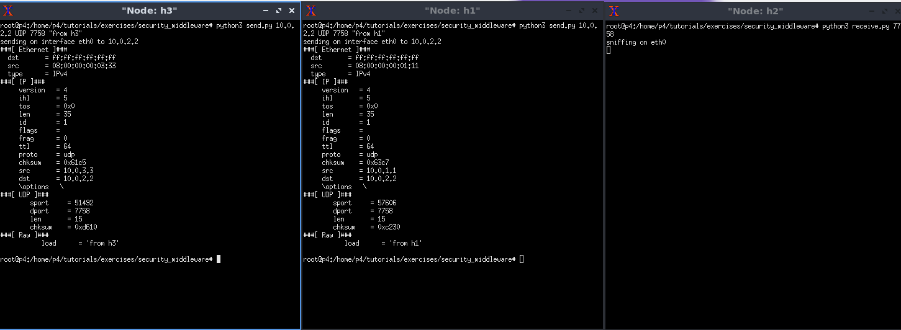

# 大作业实验报告
| 学号 | 姓名 | 工作量 |
| :---: | :---: | :---: |
| 041903101 | 吴逸凡 | 25% |
| 181700319 | 林鑫祥 | 25% |
| 081900223 | 邱泽源 | 25% |
| 021900823 | 李忱轩 | 25% |

[GitHub 链接](https://github.com/Luoky76/P4-exercise) 

## 论文 *Implementation of multiple routing configurations on software-defined networks with p4*

  该论文通过 P4 实现了多跳路由配置。为了使通信网络保持高可靠性，论文通过 MRC 技术使得网络在发生故障时能自动恢复故障。它预先备份了多个路由配置，当配置正常的路由在转发数据时发生单节点故障或链路故障时，MRC 会立即将路由配置更改为没有使用故障路由的另一个路由配置，从而继续数据传输。通过 MRC 技术，发生故障时仅需几十毫秒就可以恢复正常通信。
  论文使用如下拓扑结构：


### 核心代码
#### mrc.p4
```C
/* -*- P4_16 -*- */
#include <core.p4>
#include <v1model.p4>

const bit<16> TYPE_IPV4 = 0x800;
const bit<8>  CONFIGURATION = 0;

/*************************************************************************
*********************** H E A D E R S  ***********************************
*************************************************************************/

typedef bit<9>  egressSpec_t;
typedef bit<48> macAddr_t;
typedef bit<32> ip4Addr_t;

header ethernet_t {
    macAddr_t dstAddr;
    macAddr_t srcAddr;
    bit<16>   etherType;
}

header ipv4_t {
    bit<4>    version;
    bit<4>    ihl;
    bit<8>    diffserv;
    bit<16>   totalLen;
    bit<16>   identification;
    bit<3>    flags;
    bit<13>   fragOffset;
    bit<8>    ttl;
    bit<8>    protocol;
    bit<16>   hdrChecksum;
    ip4Addr_t srcAddr;
    ip4Addr_t dstAddr;
}

struct metadata {
    
}

struct headers {
    ethernet_t         ethernet;
    ipv4_t             ipv4;
}

/*************************************************************************
*********************** P A R S E R  ***********************************
*************************************************************************/

parser MyParser(packet_in packet,
                out headers hdr,
                inout metadata meta,
                inout standard_metadata_t standard_metadata) {

    state start {
        transition parse_ethernet;
    }

    state parse_ethernet {
        packet.extract(hdr.ethernet);
        transition select(hdr.ethernet.etherType) {
            TYPE_IPV4: parse_ipv4;
            default: accept;
        }
    }

    state parse_ipv4 {
        packet.extract(hdr.ipv4);
        transition accept;
    }

}


/*************************************************************************
************   C H E C K S U M    V E R I F I C A T I O N   *************
*************************************************************************/

control MyVerifyChecksum(inout headers hdr, inout metadata meta) {   
    apply {  }
}


/*************************************************************************
**************  I N G R E S S   P R O C E S S I N G   *******************
*************************************************************************/

control MyIngress(inout headers hdr,
                  inout metadata meta,
                  inout standard_metadata_t standard_metadata) {
    action drop() {
        mark_to_drop(standard_metadata);
    }
    
    action ipv4_forward(macAddr_t dstAddr, egressSpec_t port) {
        standard_metadata.egress_spec = port;
        hdr.ethernet.srcAddr = hdr.ethernet.dstAddr;
        hdr.ethernet.dstAddr = dstAddr;
        hdr.ipv4.ttl = hdr.ipv4.ttl - 1;
    }

    action ipv4_forward_restricted(macAddr_t dstAddr, egressSpec_t port) {
        standard_metadata.egress_spec = port;
        hdr.ethernet.srcAddr = hdr.ethernet.dstAddr;
        hdr.ethernet.dstAddr = dstAddr;
        hdr.ipv4.ttl = hdr.ipv4.ttl - 1;
    }

    table ipv4_lpm {
        key = {
            hdr.ipv4.dstAddr: lpm;
        }
        actions = {
            ipv4_forward;
            drop;
            NoAction;
        }
        size = 1024;
        default_action = NoAction();
    }
    table ipv4_lpm2 {
        key = {
            hdr.ipv4.dstAddr: lpm;
        }
        actions = {
            ipv4_forward;
            ipv4_forward_restricted;
            drop;
            NoAction;
        }
        size = 1024;
        default_action = NoAction();
    }
    table ipv4_lpm3 {
        key = {
            hdr.ipv4.dstAddr: lpm;
        }
        actions = {
            ipv4_forward;
            ipv4_forward_restricted;
            drop;
            NoAction;
        }
        size = 1024;
        default_action = NoAction();
    }
    
    apply {
    if(hdr.ipv4.diffserv != CONFIGURATION*4){
            hdr.ipv4.diffserv =  CONFIGURATION * 4;
        }
        if (hdr.ipv4.isValid()) {
           if(hdr.ipv4.diffserv == 0){
                ipv4_lpm.apply();
            }
            else if(hdr.ipv4.diffserv == 4){
            ipv4_lpm2.apply();
            }
            else{
            ipv4_lpm3.apply();
            }
        }
    }
}

/*************************************************************************
****************  E G R E S S   P R O C E S S I N G   *******************
*************************************************************************/

control MyEgress(inout headers hdr,
                 inout metadata meta,
                 inout standard_metadata_t standard_metadata) {
    apply {  }
}

/*************************************************************************
*************   C H E C K S U M    C O M P U T A T I O N   **************
*************************************************************************/

control MyComputeChecksum(inout headers hdr, inout metadata meta) {
     apply {
	update_checksum(
	    hdr.ipv4.isValid(),
            { hdr.ipv4.version,
	          hdr.ipv4.ihl,
              hdr.ipv4.diffserv,
              hdr.ipv4.totalLen,
              hdr.ipv4.identification,
              hdr.ipv4.flags,
              hdr.ipv4.fragOffset,
              hdr.ipv4.ttl,
              hdr.ipv4.protocol,
              hdr.ipv4.srcAddr,
              hdr.ipv4.dstAddr },
            hdr.ipv4.hdrChecksum,
            HashAlgorithm.csum16);
    }
}

/*************************************************************************
***********************  D E P A R S E R  *******************************
*************************************************************************/

control MyDeparser(packet_out packet, in headers hdr) {
    apply {
        packet.emit(hdr.ethernet);
        packet.emit(hdr.ipv4);
        /* TODO: emit ipv4_option, mri and swtraces headers */
    }
}

/*************************************************************************
***********************  S W I T C H  *******************************
*************************************************************************/

V1Switch(
MyParser(),
MyVerifyChecksum(),
MyIngress(),
MyEgress(),
MyComputeChecksum(),
MyDeparser()
) main;
```

### 实验结果

配置路由 A


配置路由 B


配置路由 A


论文中的吞吐量

| Configuration | Flow1 | Flow2 | Flow3 | Total |
|:-------------:|:-----:|:-----:|:-----:|:-----:|
|  (A) | 880 kbps | 500 kbps | 475 kbps | 1855 kbps |
|  (B) | 320 kbps | 318 kbps | 338 kbps | 976 kbps  |
|  (C) | 477 kbps | 503 kbps | 965 kbps | 1945 kbps |

复现吞吐量

| Configuration | Flow1 | Flow2 | Flow3 | Total |
|:-------------:|:-----:|:-----:|:-----:|:-----:|
|  (A) | 973 kbps | 506 kbps | 501 kbps | 1980 kbps |
|  (B) | 348 kbps | 344 kbps | 338 kbps | 1030 kbps |
|  (C) | 505 kbps | 505 kbps | 973 kbps | 1983 kbps |

## 论文 *Security Middleware Programming Using P4*

  该论文介绍了用 P4 语言在交换机上实现防火墙功能的方法。这个防火墙可以操作到 OSI 模型的第四层，传输层。由于 P4 交换机具有状态记忆的能力，它可以用来识别 DOS 攻击和端口扫描攻击。
  论文通过定义数个规则，使交换机拥有了对包的允许、拦截和禁止能力。无论使用 IPv4 还是 IPv6 ，TCP 还是 UDP ，它都能正确识别并运行。通过计算主机发包速率，论文还实现了对洪水攻击的检测，并在检测后能及时封锁子网或个人用户。

流程图：


  论文将其防火墙流程划分为了7个阶段，分别是：Parsing，Check Ban List，Counters，Rules，Route forward，Ban，Drop。
  在 Parsing 阶段通过解析以太网帧的协议类型字段，将包分为 IPv4、IPv6、Other 三类。进一步可以通过解析 IP 报头的协议类型字段继续分为 UDP 包和 TCP 包。简便起见，对于 Other 类的包我们将直接丢弃。换言之，我们的交换机将只允许使用以太网协议、IPv4 协议、IPv6 协议、UDP 协议和 TCP 协议。
  在 Check Ban List 阶段，论文使用 MAC 和 IP 地址来标志一名用户，假如用户违反了规则，例如发包速率过快或是发送字节数过多，那就将其加入 Ban List 中，匹配上黑名单的包将会被立即丢弃。
  在 Counters 阶段将使用计数器统计用户的发包数和发送字节数，论文为每个表都分配了一个计数器。
  在 Rules 阶段检查 whitelist ，只允许在表中的协议或主机通过。
  在 Route forward 阶段按照协议规则转发包。
  在 Ban 阶段论文将需要禁止的用户对应的寄存器位置为1，并将其丢弃。
  在 Drop 阶段将包标记为丢弃，不会转发。

  在实现中，由于语法的变化，并且也为了在数据层直接进行黑名单的自动添加，我们取消了计数器 counter 的使用，改为使用寄存器 register 。我们按照论文的表述，同时实现了一个黑名单和一个白名单。白名单有控制层通过下发流表来使用，黑名单直接在数据层通过 P4 寄存器自动维护。我们要求一个包必须在白名单下并且不在黑名单下才允许通过。白名单的职责为添加我们所允许的 IP 和 MAC，也可以是子网。黑名单的职责是将那些发包速率过快，或是发包字节速率过快的用户加入，并不再转发黑名单用户的包。
  按论文要求我们使用源 IP 和源 MAC 来标志一台主机，具体我们使用了哈希算法，将源 IP 和源 MAC 一起映射到一个具体的标号上。

### 核心代码

#### security_middleware.p4

```c
/* -*- P4_16 -*- */
#include <core.p4>
#include <v1model.p4>

const bit<16> TYPE_IPV4 = 0x0800;
const bit<16> TYPE_IPV6 = 0x86DD;
const bit<16> TYPE_ARP = 0x0806;
const bit<8> IP_TYPE_TCP = 0x06;
const bit<8> IP_TYPE_UDP = 0x11;

#define MIN_GAP_TIME 30000000
#define MAX_HOSTS 4096
#define MAX_PACKET_CNT 2
#define MAX_PACKET_BYTE 500

/*************************************************************************
*********************** H E A D E R S  ***********************************
*************************************************************************/

//HEADERS 部分定义报文的各类报头的格式

typedef bit<9>  egressSpec_t;
typedef bit<48> macAddr_t;
typedef bit<32> ip4Addr_t;
typedef bit<128> ip6Addr_t;

//以太网帧头部
header ethernet_t {
    macAddr_t dstAddr;	//MAC destination
    macAddr_t srcAddr;	//MAC source
    bit<16>   etherType;	//ipv4:0x0800 ARP:0x0806 ipv6:0x86DD
}

//ipv4帧头部
header ipv4_t {
    bit<4>    version;	//ip协议号
    bit<4>    ihl;	//首部长度
    bit<8>    diffserv;	//区分服务
    bit<16>   totalLen;	//总长度 首部与数据之和
    bit<16>   identification;	//报文标识
    bit<3>    flags;	//无效 允许分片 有后续分片
    bit<13>   fragOffset;	//片位移
    bit<8>    ttl;	//生存时间
    bit<8>    protocol;	//协议 UDP=17 TCP=6
    bit<16>   hdrChecksum;	//首部校验和
    ip4Addr_t srcAddr;	//源ip
    ip4Addr_t dstAddr;	//目的ip
}

//ipv6帧头部
header ipv6_t {
    bit<4>    version;	//ip协议号
    bit<8>    trafficClass;	//通信分类
    bit<20>   flowLabel;	//流标签
    bit<16>   payLoadLen;	//有效载荷长度
    bit<8>    nextHdr;	//下一个头部 UDP=17 TCP=6
    bit<8>    hopLimit;	//跳数限制
    bit<128>  srcAddr;	//源ip
    bit<128>  dstAddr;	//目的ip
}

//tcp帧头部
header tcp_t {
    bit<16> srcPort;
    bit<16> dstPort;
    bit<32> seqNo;
    bit<32> ackNo;
    bit<4>  dataOffset;
    bit<3>  res;
    bit<3>  ecn;
    bit<6>  ctrl;
    bit<16> window;
    bit<16> checksum;
    bit<16> urgentPtr;
}

//udp帧头部
header udp_t {
    bit<16> srcPort;
    bit<16> dstPort;
    bit<16> pkt_length;
    bit<16> checksum;
}

//元数据 用于携带数据和配置信息
struct metadata {
    bit<1> in_ip_white;
    bit<1> in_mac_white;
    bit<1> in_black;
}

//包头部
struct headers {
    ethernet_t   ethernet;
    ipv4_t       ipv4;
    ipv6_t       ipv6;
    tcp_t        tcp;
    udp_t        udp;
}

/*************************************************************************
*********************** P A R S E R  ***********************************
*************************************************************************/

//PARSER 部分描述如何处理所收到报文的包头，这包括包头的解析顺序，从报文中要提取的包头和字段等

parser MyParser(packet_in packet,
                out headers hdr,
                inout metadata meta,
                inout standard_metadata_t standard_metadata) {

    //transition 的初态，仅考虑以太网帧，所以直接进入以太网帧的解析状态
    state start {
        transition parse_ethernet;
    }

    //解析以太网帧
    state parse_ethernet {
        packet.extract(hdr.ethernet);	//提取包中的以太网帧头
        //根据以太网帧的 etherType 字段决定 transition 的下个状态
        transition select(hdr.ethernet.etherType) {
            TYPE_IPV4: parse_ipv4;	//0x0800为ipv4
            TYPE_IPV6: parse_ipv6;	//0x86DD为ipv6
            default: accept;
        }
    }

    //解析ipv4
    state parse_ipv4 {
        packet.extract(hdr.ipv4);	//继续提取ipv4头
        transition select(hdr.ipv4.protocol) {
            IP_TYPE_TCP: parse_tcp;
            IP_TYPE_UDP: parse_udp;
            default: accept;
        }
    }

    //解析ipv6
    state parse_ipv6 {
        packet.extract(hdr.ipv6);	//继续提取ipv6头
        transition select(hdr.ipv6.nextHdr) {
            IP_TYPE_TCP: parse_tcp;
            IP_TYPE_UDP: parse_udp;
            default: accept;
        }
    }

    //解析tcp
    state parse_tcp {
        packet.extract(hdr.tcp);
        transition accept;
    }

    //解析udp
    state parse_udp {
        packet.extract(hdr.udp);
        transition accept;
    }
}


/*************************************************************************
************   C H E C K S U M    V E R I F I C A T I O N   *************
*************************************************************************/

control MyVerifyChecksum(inout headers hdr, inout metadata meta) {
    apply {  }
}


/*************************************************************************
**************  I N G R E S S   P R O C E S S I N G   *******************
*************************************************************************/

//INGRESS PROCESSING 部分主要用于处理包头的字段以及元数据，是数据包进入的处理
//根据 table 将用于定义的 key 和 action 关联，从而实现数据包的转发或丢弃
//apply 为执行入口

control MyIngress(inout headers hdr,
                  inout metadata meta,
                  inout standard_metadata_t standard_metadata) {

    //声明寄存器用于记录各个主机发送的包数和字节数
    register<bit<32>>(MAX_HOSTS) packet_cnt_reg;
    register<bit<32>>(MAX_HOSTS) byte_cnt_reg;
    register<bit<48>>(MAX_HOSTS) last_time_reg;

    //只允许在白名单并且不在黑名单的包通过
    //声明寄存器用于记录黑名单，每一位代表一台主机，1为禁止，0为允许
    register<bit<1>>(MAX_HOSTS) ban_list_reg;

    //声明便利存储黑名单寄存器对应位置的值
    bit<1> ban;

    //声明变量用于存储当前报文的源主机对应的寄存器位置
    bit<32> reg_pos;
    bit<32> reg_packet_cnt_val;
    bit<32> reg_byte_cnt_val;
    bit<48> reg_last_time_val;

    action drop() {
        //将要丢弃的包标记为丢弃
        mark_to_drop(standard_metadata);
    }

    //ipv4 转发动作
    action ipv4_forward(macAddr_t dstAddr, egressSpec_t port) {
        //选择数据包的输出端口
        standard_metadata.egress_spec = port;
        //更改以太网帧头的 MAC 目标地址及源地址
        hdr.ethernet.srcAddr = hdr.ethernet.dstAddr;
        hdr.ethernet.dstAddr = dstAddr;
        //修改 ipv4 报头的生存时间
        hdr.ipv4.ttl = hdr.ipv4.ttl-1;
    }

    table ipv4_lpm {
        key = {
            //lpm是最长前缀匹配，exact完全匹配，ternary三元匹配
            hdr.ipv4.dstAddr: lpm;
        }
        actions = {
            ipv4_forward;	//转发
            drop;	//丢弃
            NoAction;	//空动作
        }
        size = 1024;	//流表项容量
        default_action = drop();	//table miss 则丢弃
    }

    action ipv6_forward(macAddr_t dstAddr, egressSpec_t port) {
        standard_metadata.egress_spec = port;
        hdr.ethernet.srcAddr = hdr.ethernet.dstAddr;
        hdr.ethernet.dstAddr = dstAddr;
        hdr.ipv6.hopLimit = hdr.ipv6.hopLimit-1;//这个类似ipv4中ttl，为0时就超时
    }

    table ipv6_lpm {
        key = {
            hdr.ipv6.dstAddr: lpm;
        }

        actions = {
            ipv6_forward;//转发
            drop;//丢弃
            NoAction;//空动作
        }
        size = 1024;//流表项容量
        default_action = drop();//table miss 则丢弃
    }

    action set_ip_white(){
        meta.in_ip_white=1;
    }

    // action set_mac_white(){
    //     meta.in_mac_white=1;
    // }

    table ipv4_white_exact{
        key = {
            hdr.ipv4.srcAddr: ternary;
            //hdr.ethernet.srcAddr: ternary;
        }

        actions={
            set_ip_white;
            //set_mac_white;
            drop;
            NoAction;
        }
        size = 1024;
        default_action = drop();
    }


    //更新寄存器的值
    action update_register() {
        //包数+1
        packet_cnt_reg.read(reg_packet_cnt_val, reg_pos);
        packet_cnt_reg.write(reg_pos, reg_packet_cnt_val + 1);

        //从标准元数据中读取包长并更新主机发送的字节数
        byte_cnt_reg.read(reg_byte_cnt_val, reg_pos);
        byte_cnt_reg.write(reg_pos, reg_byte_cnt_val + standard_metadata.packet_length);

        //读取上次进包时间
        last_time_reg.read(reg_last_time_val,reg_pos);
    }

    action set_black(){
        ban_list_reg.write(reg_pos,1);
        meta.in_black=1;
    }

    action reset_black(){
        last_time_reg.write(reg_pos,standard_metadata.ingress_global_timestamp);
        ban_list_reg.write(reg_pos,0);
        packet_cnt_reg.write(reg_pos,0);
        byte_cnt_reg.write(reg_pos,0);
    }

    //通过哈希源ip地址和源mac地址来得到主机的一个标识号
    action compute_ipv4_hashes(ip4Addr_t ipAddr, macAddr_t macAddr) {
       //利用哈希函数crc32得到寄存器位置
       //返回值在[0,4095]之间
       hash(reg_pos, HashAlgorithm.crc32, (bit<32>)0, {ipAddr,
                                                       macAddr},
                                                       (bit<32>)MAX_HOSTS);
       //FIXME 当哈希值发生冲突时将会出错
    }

    action compute_ipv6_hashes(ip6Addr_t ipAddr, macAddr_t macAddr) {
       //利用哈希函数crc32得到寄存器位置
       //返回值在[0,4095]之间
       hash(reg_pos, HashAlgorithm.crc32, (bit<32>)0, {ipAddr,
                                                       macAddr},
                                                       (bit<32>)MAX_HOSTS);
    }

    action check_ban_list() {
        ban_list_reg.read(ban, reg_pos);
    }

    apply {
        //如果 ipv4 有效，则执行 ipv4 的匹配 table
        if (hdr.ipv4.isValid())
        {
            compute_ipv4_hashes(hdr.ipv4.srcAddr, hdr.ethernet.srcAddr);
            update_register();

            if(standard_metadata.ingress_global_timestamp - reg_last_time_val < MIN_GAP_TIME){
                if(reg_byte_cnt_val>=MAX_PACKET_BYTE || reg_packet_cnt_val>=MAX_PACKET_CNT){
                    set_black();
                }
            }
            else{
                reset_black();
            }

            check_ban_list();
            ipv4_white_exact.apply();

            //if (ban == 1 || meta.in_ip_white == 0 || meta.in_mac_white == 0) {
            if (meta.in_black == 1 || meta.in_ip_white == 0) {
                drop();
            }else{
                ipv4_lpm.apply();
            }
        }

        //如果 ipv6 有效，则执行 ipv6 的匹配 table
        if (hdr.ipv6.isValid())
        {
            compute_ipv6_hashes(hdr.ipv6.srcAddr, hdr.ethernet.srcAddr);
            update_register();

            if(standard_metadata.ingress_global_timestamp - reg_last_time_val < MIN_GAP_TIME){
                if(reg_byte_cnt_val>=MAX_PACKET_BYTE || reg_packet_cnt_val<=MAX_PACKET_CNT){
                    set_black();
                }
            }
            else{
                reset_black();
            }

            check_ban_list();
            if (ban == 1) drop();
            ipv6_lpm.apply();
        }
    }
}

/*************************************************************************
****************  E G R E S S   P R O C E S S I N G   *******************
*************************************************************************/

//EGRESS 用于进行数据包转出时的处理

control MyEgress(inout headers hdr,
                 inout metadata meta,
                 inout standard_metadata_t standard_metadata) {
    apply {  }
}

/*************************************************************************
*************   C H E C K S U M    C O M P U T A T I O N   **************
*************************************************************************/

//计算首部校验和
control MyComputeChecksum(inout headers hdr, inout metadata meta) {
     apply {
        //调用 v1model.p4 库的函数自动计算ipv4首部校验和
        update_checksum(
            hdr.ipv4.isValid(),
            { hdr.ipv4.version,
              hdr.ipv4.ihl,
              hdr.ipv4.diffserv,
              hdr.ipv4.totalLen,
              hdr.ipv4.identification,
              hdr.ipv4.flags,
              hdr.ipv4.fragOffset,
              hdr.ipv4.ttl,
              hdr.ipv4.protocol,
              hdr.ipv4.srcAddr,
              hdr.ipv4.dstAddr },
            hdr.ipv4.hdrChecksum,
            HashAlgorithm.csum16);
    }
}


/*************************************************************************
***********************  D E P A R S E R  *******************************
*************************************************************************/

control MyDeparser(packet_out packet, in headers hdr) {
    apply {
        //发送包头
        packet.emit(hdr.ethernet);
        packet.emit(hdr.ipv4);
        packet.emit(hdr.ipv6);
        packet.emit(hdr.tcp);
        packet.emit(hdr.udp);
    }
}

/*************************************************************************
***********************  S W I T C H  *******************************
*************************************************************************/

V1Switch(
MyParser(),
MyVerifyChecksum(),
MyIngress(),
MyEgress(),
MyComputeChecksum(),
MyDeparser()
) main;

```

#### s1-runtime.json

```json
{
  "target": "bmv2",
  "p4info": "build/security_middleware.p4.p4info.txt",
  "bmv2_json": "build/security_middleware.json",
  "table_entries": [
    {
      "table": "MyIngress.ipv4_lpm",
      "default_action": true,
      "action_name": "MyIngress.drop",
      "action_params": { }
    },
    {
      "table": "MyIngress.ipv4_lpm",
      "match": {
        "hdr.ipv4.dstAddr": ["10.0.1.1", 32]
      },
      "action_name": "MyIngress.ipv4_forward",
      "action_params": {
        "dstAddr": "08:00:00:00:01:11",
        "port": 1
      }
    },
    {
      "table": "MyIngress.ipv4_lpm",
      "match": {
        "hdr.ipv4.dstAddr": ["10.0.2.2", 32]
      },
      "action_name": "MyIngress.ipv4_forward",
      "action_params": {
        "dstAddr": "08:00:00:00:02:22",
        "port": 2
      }
    },
    {
      "table": "MyIngress.ipv4_lpm",
      "match": {
        "hdr.ipv4.dstAddr": ["10.0.3.3", 32]
      },
      "action_name": "MyIngress.ipv4_forward",
      "action_params": {
        "dstAddr": "00:00:00:00:03:01",
        "port": 3
      }
    },
    {
      "table": "MyIngress.ipv4_lpm",
      "match": {
        "hdr.ipv4.dstAddr": ["10.0.4.4", 32]
      },
      "action_name": "MyIngress.ipv4_forward",
      "action_params": {
        "dstAddr": "00:00:00:00:04:02",
        "port": 4
      }
    },
    {
      "table": "MyIngress.ipv4_white_exact",
      "default_action": true,
      "action_name": "MyIngress.drop",
      "action_params": { }
    },
    {
      "table": "MyIngress.ipv4_white_exact",
      "match": {
        "hdr.ipv4.srcAddr": ["10.0.2.2", 4294967295]
      },
      "action_name": "MyIngress.set_ip_white",
      "action_params": { },
      "priority": 1
    },
    {
      "table": "MyIngress.ipv4_white_exact",
      "match": {
        "hdr.ipv4.srcAddr": ["10.0.4.4", 4294967295]
      },
      "action_name": "MyIngress.set_ip_white",
      "action_params": { },
      "priority": 1
    }
  ]
}
```
其它交换机的 JSON 文件与之类似，详细请参看仓库

### 实验结果
我们将 h2 和 h4 的 ip 加入白名单

可见由于不在白名单内，h1 和 h3 都不能发包给 h2

为测试方便，我们设置每台主机 30 秒内不允许发送超过 2 个包，由 h4 向 h2 发包

可见第 3 包已经被拦截

为测试方便，我们设置每台主机 30 秒内不允许发送超过 700 字节
h4 连续发包

h2 收包

可见，当 30 秒内累计发送字节超过 700 字节时，后续包均被拦截

## 个人总结
### 吴逸凡
本次课程我系统地学习了 P4 语言，它在交换机上实现了前所未有的高自由度，无论是自定义报头还是自定义转发规则它都非常方便。学习期间我查找了众多资料，以下为几个我认为比较优秀的参考资料：

[P4语言介绍](https://yeya24.github.io/post/p4/) [P4语法](https://www.cnblogs.com/pullself/p/10383343.html) [利用P4实现ipv6转发实验](https://www.cnblogs.com/pullself/p/10418743.html) [P4标准元数据](https://www.jianshu.com/p/044761dc2ea9) [P4控制逻辑与完整的工作流](https://zhuanlan.zhihu.com/p/347282455) [P4知乎教程](https://www.zhihu.com/people/yaoj-x/posts) [P4的ternary匹配](https://blog.csdn.net/qq_41854763/article/details/105383669) [P4 runtime](https://blog.csdn.net/qq_33681684/article/details/123646883) [IPY的使用](https://www.cnblogs.com/cherishry/p/5916935.html) [P4 register的使用经验](https://www.codenong.com/cs106538990/) [P4编程基础](https://bbs.huaweicloud.com/blogs/detail/288890)

平台包括博客园、CSDN、知乎、华为云、简书、GitHub 等。

P4 程序目前还有不尽人意的地方，在本次学习中，我的直观感受是 P4 太难调试 Debug 了。无论是逐步调试程序还是输出中间过程调试，现有的 P4 程序都无法实现，导致出现问题时就只能看着代码自行思考代码逻辑。而且数据层和控制层的分离也意味着出错的地方不仅有可能是代码，也有可能是流表的下发规则，这也为修改错误带来许多麻烦。

由于网上 P4 教程的稀缺以及教程质量的良莠不齐，所以经常遇到问题而又无法解决，只能在一次次的试错中总结经验。这次课程也提高了我查找和阅读英文资料的能力，P4 的英文资料会比中文资料更多，也更全。

### 林鑫祥
P4 是基于 python 和 c 语言的一门新的语言，它是对计算机网络包的转发作了高度抽象，便于我们灵活地通过编写软件的方式控制硬件，或者说是可编程硬件的一种。P4里分为`parser`,`ingress`,`egress`和`deparser`几个阶段。`Ingress`和`egress`是控制流里比较重要的部分。同时了解到 ARP 转发时也去翻看了计算机网络了解到 ARP 转发以及需要用到的协议。第二次实验则是了解到隧道方式的转发通信，隧道是单向而且占用端口是不重复的。学会了通过 mycontroller.py 实现控制平面的流表下发，配置交换机。第三次实验则复习了传统的多跳路由检测和拥塞控制的知识，并用于 P4 上。通过 ecn 字段判断是否拥塞，通过递增 ipv4 的 TTL 字段，并利用 ICMP 差错报文来不断探测下一条的路由地址. 同时也了解了 tos 字段。分为6字节的区分服务 diffserv 和2字节的 ecn。复习了 TCP 协议，学习了防火墙的基本原理，学习了寄存器的基本使用，同时也了解到了 Counter 计数器。同时也查看了 V1model.p4 文件去查看了里面的内容。
平台： 去 GitHub 官网，知乎，博客园以及 CSDN 上面去找，同时也参考了老师发的资料。
通过本次实验，我对应 P4 编码能力提升，同时会通过控制平面，根据拓扑结构实现对应的流表下发。相比于传统的计算机网络，P4 可以实现很多传统网络无法实现的功能。通过可编程交换机和控制平面可以实现对传统路由无法实现的防火墙机制，并起到过滤报文的作用。也了解了学习一门新知识的不容易。

### 邱泽源
本次课程中我学习了 P4 语言的基本用法，他使得计算机网络编程变得易于上手，可以通过代码形式控制路由器转发、路由功能。通过这次学习，我认识到P4执行主要有4个阶段：`Parser`，`Ingress`，`Egress`，`Deparser`。学习过程中我学会了状态机的概念。本次学习中学会了使用 P4 语言进行隧道转发，拥塞控制和探明路由地址，建立防火墙等功能。

平台：GitHub、CSDN、老师的ppt

在本次结束后中 ，我对 P4 有了一个直观的理解，加深了我多计算机网络的理解。很感谢有一次这样的机会能够挑战一门全新的语言。

### 李忱轩
我了解到了 P4 是基于 python 的新的可编程网络语言，它对传统计算机网络做了一次高度编程化，使我们可以通过代码形式控制路由器转发、路由功能，通过这次学习，我认识到：P4 里分为四大阶段。`Ingress`阶段与`egress`阶段是其中的核心部分。同时对传统计算机网络中的 ARP 协议有了更深的了解。在之后，通过实现隧道的转发通信，了解到了隧道的基本特性， 之后学习通过 ecn 字段判断是否拥塞，学习了利用`traceroute`来探测下一跳的路由地址. 了解了 tos 字段。在大作业中，学习了防火墙的基本原理。
平台：GitHub、博客园、CSDN 、stackoverflow、老师 ppt 和相关教程。
在本次结束后中 ，我对 P4 有了一个直观的理解，并初步学会了相关编码对过程，比如通过控制平面，利用相关的拓扑结构实现对应流表下发。在这次学习过程中，我了解了P4的相关特性，比如可以通过可编程交换机和控制平面实现防火墙、过滤报文等功能。

