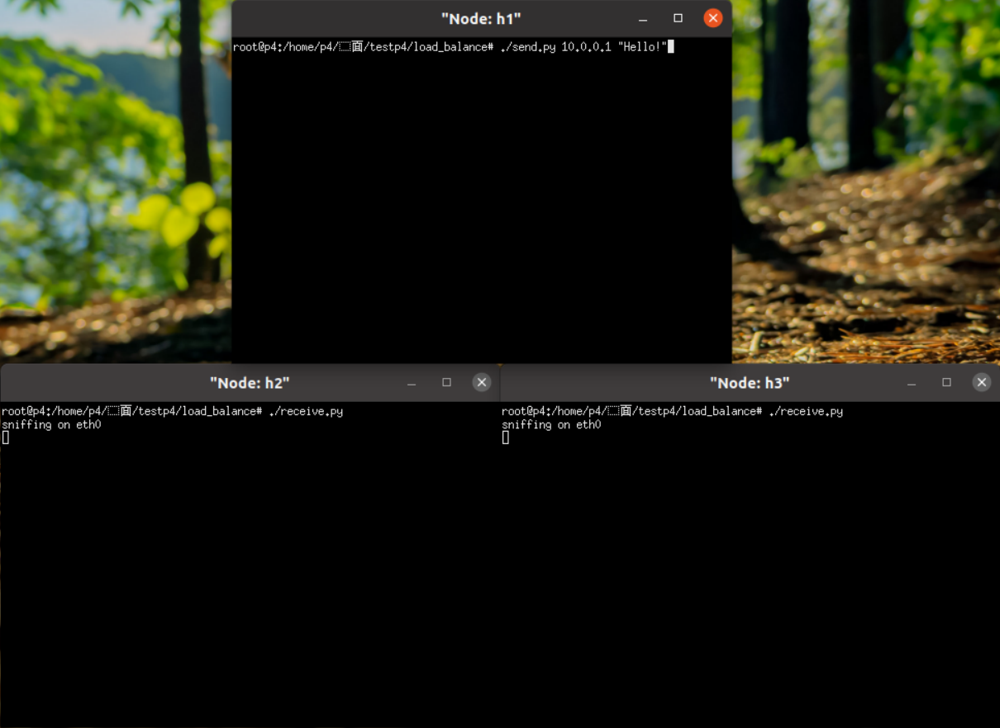
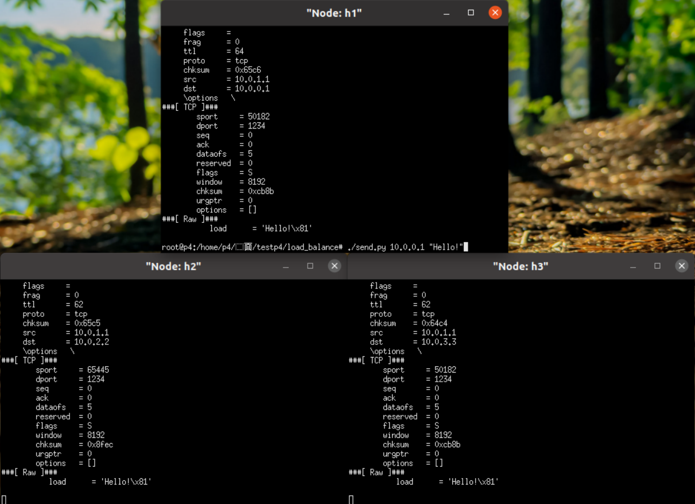

# 第四次实验报告

## source_routing 实验

### source_routing.p4
```c++
/* -*- P4_16 -*- */
#include <core.p4>
#include <v1model.p4>

const bit<16> TYPE_IPV4 = 0x800;
const bit<16> TYPE_SRCROUTING = 0x1234;

#define MAX_HOPS 9

/*************************************************************************
*********************** H E A D E R S  ***********************************
*************************************************************************/

typedef bit<9>  egressSpec_t;
typedef bit<48> macAddr_t;
typedef bit<32> ip4Addr_t;

header ethernet_t {
    macAddr_t dstAddr;
    macAddr_t srcAddr;
    bit<16>   etherType;
}

header srcRoute_t {
    bit<1>    bos;  //bottom of stack 栈底标记
    bit<15>   port; //转发端口
}

header ipv4_t {
    bit<4>    version;
    bit<4>    ihl;
    bit<8>    diffserv;
    bit<16>   totalLen;
    bit<16>   identification;
    bit<3>    flags;
    bit<13>   fragOffset;
    bit<8>    ttl;
    bit<8>    protocol;
    bit<16>   hdrChecksum;
    ip4Addr_t srcAddr;
    ip4Addr_t dstAddr;
}

struct metadata {
    /* empty */
}

struct headers {
    ethernet_t              ethernet;
    srcRoute_t[MAX_HOPS]    srcRoutes;
    ipv4_t                  ipv4;
}

/*************************************************************************
*********************** P A R S E R  ***********************************
*************************************************************************/

parser MyParser(packet_in packet,
                out headers hdr,
                inout metadata meta,
                inout standard_metadata_t standard_metadata) {


    state start {
        transition parse_ethernet;
    }

    state parse_ethernet {
        packet.extract(hdr.ethernet);
        /*
         * TODO: Modify the next line to select on hdr.ethernet.etherType
         * If the value is TYPE_SRCROUTING transition to parse_srcRouting
         * otherwise transition to accept.
         */
        //解析以太网协议类型
        transition select(hdr.ethernet.etherType) {
            TYPE_SRCROUTING: parse_srcRouting;
            TYPE_IPV4: parse_ipv4;
            default: accept;
        }
    }

    state parse_srcRouting {
        /*
         * TODO: extract the next entry of hdr.srcRoutes
         * while hdr.srcRoutes.last.bos is 0 transition to this state
         * otherwise parse ipv4
         */
        //解析一跳源路由
        packet.extract(hdr.srcRoutes.next);
        //根据栈底标记决定是否继续解析，新解析的在最后last
        transition select(hdr.srcRoutes.last.bos) {
            0: parse_srcRouting;
            1: parse_ipv4;
            default: accept;
        }
    }

    state parse_ipv4 {
        packet.extract(hdr.ipv4);
        transition accept;
    }

}


/*************************************************************************
************   C H E C K S U M    V E R I F I C A T I O N   *************
*************************************************************************/

control MyVerifyChecksum(inout headers hdr, inout metadata meta) {
    apply {  }
}


/*************************************************************************
**************  I N G R E S S   P R O C E S S I N G   *******************
*************************************************************************/

control MyIngress(inout headers hdr,
                  inout metadata meta,
                  inout standard_metadata_t standard_metadata) {

    action drop() {
        mark_to_drop(standard_metadata);
    }

    action srcRoute_nhop() {
        /*
         * TODO: set standard_metadata.egress_spec
         * to the port in hdr.srcRoutes[0] and
         * pop an entry from hdr.srcRoutes
         */
        //设置发送端口 由于位数不同需要类型转化 将15位变为9位
        standard_metadata.egress_spec = (egressSpec_t)hdr.srcRoutes[0].port;
        //将属于本跳路由的端口弹出
        hdr.srcRoutes.pop_front(1);
    }

    action srcRoute_finish() {
        hdr.ethernet.etherType = TYPE_IPV4;
    }

    action update_ttl(){
        hdr.ipv4.ttl = hdr.ipv4.ttl - 1;
    }

    apply {
        if (hdr.srcRoutes[0].isValid()){
            /*
             * TODO: add logic to:
             * - If final srcRoutes (top of stack has bos==1):
             *   - change etherType to IP
             * - choose next hop and remove top of srcRoutes stack
             */
            //栈顶元素是栈底 即只剩本跳的指定端口时，更改以太网帧协议类型
            if (hdr.srcRoutes[0].bos == 1){
                srcRoute_finish();
            }
            //选择发送端口
            srcRoute_nhop();
            //更新ipv4.ttl
            if (hdr.ipv4.isValid()){
                update_ttl();
            }
        }else{
            drop();
        }
    }
}

/*************************************************************************
****************  E G R E S S   P R O C E S S I N G   *******************
*************************************************************************/

control MyEgress(inout headers hdr,
                 inout metadata meta,
                 inout standard_metadata_t standard_metadata) {
    apply {  }
}

/*************************************************************************
*************   C H E C K S U M    C O M P U T A T I O N   **************
*************************************************************************/

control MyComputeChecksum(inout headers hdr, inout metadata meta) {
    apply {  }
}

/*************************************************************************
***********************  D E P A R S E R  *******************************
*************************************************************************/

control MyDeparser(packet_out packet, in headers hdr) {
    apply {
        packet.emit(hdr.ethernet);
        packet.emit(hdr.srcRoutes);
        packet.emit(hdr.ipv4);
    }
}

/*************************************************************************
***********************  S W I T C H  *******************************
*************************************************************************/

V1Switch(
MyParser(),
MyVerifyChecksum(),
MyIngress(),
MyEgress(),
MyComputeChecksum(),
MyDeparser()
) main;

```

### 实验结果

完善代码前，`h2`无法正常接收到报文


完善代码后，用`xterm`打开`h1`、`h2`的终端


分别在两个终端上发送报文和接收报文


输入路由路径后发送报文，`h2`成功接收到报文，并且 ttl 减少了 5


用另一条路由路径测试，依然成功接收，并且 ttl 减少了 3


## calc 实验

### calc.p4

```c++
/* -*- P4_16 -*- */

/*
 * P4 Calculator
 *
 * This program implements a simple protocol. It can be carried over Ethernet
 * (Ethertype 0x1234).
 *
 * The Protocol header looks like this:
 *
 *        0                1                  2              3
 * +----------------+----------------+----------------+---------------+
 * |      P         |       4        |     Version    |     Op        |
 * +----------------+----------------+----------------+---------------+
 * |                              Operand A                           |
 * +----------------+----------------+----------------+---------------+
 * |                              Operand B                           |
 * +----------------+----------------+----------------+---------------+
 * |                              Result                              |
 * +----------------+----------------+----------------+---------------+
 *
 * P is an ASCII Letter 'P' (0x50)
 * 4 is an ASCII Letter '4' (0x34)
 * Version is currently 0.1 (0x01)
 * Op is an operation to Perform:
 *   '+' (0x2b) Result = OperandA + OperandB
 *   '-' (0x2d) Result = OperandA - OperandB
 *   '&' (0x26) Result = OperandA & OperandB
 *   '|' (0x7c) Result = OperandA | OperandB
 *   '^' (0x5e) Result = OperandA ^ OperandB
 *
 * The device receives a packet, performs the requested operation, fills in the
 * result and sends the packet back out of the same port it came in on, while
 * swapping the source and destination addresses.
 *
 * If an unknown operation is specified or the header is not valid, the packet
 * is dropped
 */

#include <core.p4>
#include <v1model.p4>

/*
 * Define the headers the program will recognize
 */

/*
 * Standard Ethernet header
 */
header ethernet_t {
    bit<48> dstAddr;
    bit<48> srcAddr;
    bit<16> etherType;
}

/*
 * This is a custom protocol header for the calculator. We'll use
 * etherType 0x1234 for it (see parser)
 */
const bit<16> P4CALC_ETYPE = 0x1234;
const bit<8>  P4CALC_P     = 0x50;   // 'P'
const bit<8>  P4CALC_4     = 0x34;   // '4'
const bit<8>  P4CALC_VER   = 0x01;   // v0.1
const bit<8>  P4CALC_PLUS  = 0x2b;   // '+'
const bit<8>  P4CALC_MINUS = 0x2d;   // '-'
const bit<8>  P4CALC_AND   = 0x26;   // '&'
const bit<8>  P4CALC_OR    = 0x7c;   // '|'
const bit<8>  P4CALC_CARET = 0x5e;   // '^'

header p4calc_t {
/* TODO
 * fill p4calc_t header with p, four, ver, op, operand_a, operand_b, and res
   entries based on above protocol header definition.
 */
    //自定义新报头
    bit<8>  p;
    bit<8>  four;
    bit<8>  ver;
    bit<8>  op;
    bit<32> operand_a;
    bit<32> operand_b;
    bit<32> res;
}

/*
 * All headers, used in the program needs to be assembled into a single struct.
 * We only need to declare the type, but there is no need to instantiate it,
 * because it is done "by the architecture", i.e. outside of P4 functions
 */
struct headers {
    ethernet_t   ethernet;
    p4calc_t     p4calc;
}

/*
 * All metadata, globally used in the program, also  needs to be assembled
 * into a single struct. As in the case of the headers, we only need to
 * declare the type, but there is no need to instantiate it,
 * because it is done "by the architecture", i.e. outside of P4 functions
 */

struct metadata {
    /* In our case it is empty */
}

/*************************************************************************
 ***********************  P A R S E R  ***********************************
 *************************************************************************/
parser MyParser(packet_in packet,
                out headers hdr,
                inout metadata meta,
                inout standard_metadata_t standard_metadata) {
    state start {
        packet.extract(hdr.ethernet);
        transition select(hdr.ethernet.etherType) {
            P4CALC_ETYPE : check_p4calc;
            default      : accept;
        }
    }

    state check_p4calc {
        /* TODO: just uncomment the following parse block */
        //核对自定义报头的 p four ver 字段
        transition select(packet.lookahead<p4calc_t>().p,
        packet.lookahead<p4calc_t>().four,
        packet.lookahead<p4calc_t>().ver) {
            (P4CALC_P, P4CALC_4, P4CALC_VER) : parse_p4calc;
            default                          : accept;
        }
    }

    state parse_p4calc {
        packet.extract(hdr.p4calc);
        transition accept;
    }
}

/*************************************************************************
 ************   C H E C K S U M    V E R I F I C A T I O N   *************
 *************************************************************************/
control MyVerifyChecksum(inout headers hdr,
                         inout metadata meta) {
    apply { }
}

/*************************************************************************
 **************  I N G R E S S   P R O C E S S I N G   *******************
 *************************************************************************/
control MyIngress(inout headers hdr,
                  inout metadata meta,
                  inout standard_metadata_t standard_metadata) {
    action send_back(bit<32> result) {
        /* TODO
         * - put the result back in hdr.p4calc.res
         * - swap MAC addresses in hdr.ethernet.dstAddr and
         *   hdr.ethernet.srcAddr using a temp variable
         * - Send the packet back to the port it came from
             by saving standard_metadata.ingress_port into
             standard_metadata.egress_spec
         */
        //把运算结果加进报头res字段中
        hdr.p4calc.res = result;
        //交换以太网帧的源地址和目的地址
        hdr.ethernet.dstAddr = hdr.ethernet.dstAddr ^ hdr.ethernet.srcAddr;
        hdr.ethernet.srcAddr = hdr.ethernet.dstAddr ^ hdr.ethernet.srcAddr;
        hdr.ethernet.dstAddr = hdr.ethernet.dstAddr ^ hdr.ethernet.srcAddr;
        //从哪个端口接收就从哪个端口送回
        standard_metadata.egress_spec = standard_metadata.ingress_port;
    }

    action operation_add() {
        /* TODO call send_back with operand_a + operand_b */
        send_back(hdr.p4calc.operand_a + hdr.p4calc.operand_b);
    }

    action operation_sub() {
        /* TODO call send_back with operand_a - operand_b */
        send_back(hdr.p4calc.operand_a - hdr.p4calc.operand_b);
    }

    action operation_and() {
        /* TODO call send_back with operand_a & operand_b */
        send_back(hdr.p4calc.operand_a & hdr.p4calc.operand_b);
    }

    action operation_or() {
        /* TODO call send_back with operand_a | operand_b */
        send_back(hdr.p4calc.operand_a | hdr.p4calc.operand_b);
    }

    action operation_xor() {
        /* TODO call send_back with operand_a ^ operand_b */
        send_back(hdr.p4calc.operand_a ^ hdr.p4calc.operand_b);
    }

    action operation_drop() {
        mark_to_drop(standard_metadata);
    }

    table calculate {
        //通过精确匹配op字段决定操作
        key = {
            hdr.p4calc.op        : exact;
        }
        actions = {
            operation_add;
            operation_sub;
            operation_and;
            operation_or;
            operation_xor;
            operation_drop;
        }
        const default_action = operation_drop();
        const entries = {
            P4CALC_PLUS : operation_add();
            P4CALC_MINUS: operation_sub();
            P4CALC_AND  : operation_and();
            P4CALC_OR   : operation_or();
            P4CALC_CARET: operation_xor();
        }
    }

    apply {
        if (hdr.p4calc.isValid()) {
            calculate.apply();
        } else {
            operation_drop();
        }
    }
}

/*************************************************************************
 ****************  E G R E S S   P R O C E S S I N G   *******************
 *************************************************************************/
control MyEgress(inout headers hdr,
                 inout metadata meta,
                 inout standard_metadata_t standard_metadata) {
    apply { }
}

/*************************************************************************
 *************   C H E C K S U M    C O M P U T A T I O N   **************
 *************************************************************************/

control MyComputeChecksum(inout headers hdr, inout metadata meta) {
    apply { }
}

/*************************************************************************
 ***********************  D E P A R S E R  *******************************
 *************************************************************************/
control MyDeparser(packet_out packet, in headers hdr) {
    apply {
        packet.emit(hdr.ethernet);
        packet.emit(hdr.p4calc);
    }
}

/*************************************************************************
 ***********************  S W I T T C H **********************************
 *************************************************************************/

V1Switch(
MyParser(),
MyVerifyChecksum(),
MyIngress(),
MyEgress(),
MyComputeChecksum(),
MyDeparser()
) main;

```

### 实验结果

完善代码前，无法接收到计算结果


完善代码后，各种计算结果均正确返回


## load_balance 实验

### load_balance.p4

```c++
/* -*- P4_16 -*- */
#include <core.p4>
#include <v1model.p4>

/*************************************************************************
*********************** H E A D E R S  ***********************************
*************************************************************************/

header ethernet_t {
    bit<48> dstAddr;
    bit<48> srcAddr;
    bit<16> etherType;
}

header ipv4_t {
    bit<4>  version;
    bit<4>  ihl;
    bit<8>  diffserv;
    bit<16> totalLen;
    bit<16> identification;
    bit<3>  flags;
    bit<13> fragOffset;
    bit<8>  ttl;
    bit<8>  protocol;
    bit<16> hdrChecksum;
    bit<32> srcAddr;
    bit<32> dstAddr;
}

header tcp_t {
    bit<16> srcPort;	//源端口
    bit<16> dstPort;	//目的端口
    bit<32> seqNo;	//数据包首字节序列号
    bit<32> ackNo;	//确认序列号
    bit<4>  dataOffset;	//数据偏移量（首部长度） 单位：32bit 4Byte
    bit<3>  res;	//保留位
    bit<3>  ecn;	//保留位
    bit<6>  ctrl;	//控制位 紧急URG 确认ACK 推送PSH 复位RST 同步SYN 终止FIN
    bit<16> window;	//窗口 己方接收窗口大小 单位：字节
    bit<16> checksum;	//校验和 含伪首部
    bit<16> urgentPtr;	//紧急指针
}

struct metadata {
    bit<14> ecmp_select;
}

struct headers {
    ethernet_t ethernet;
    ipv4_t     ipv4;
    tcp_t      tcp;
}

/*************************************************************************
*********************** P A R S E R  ***********************************
*************************************************************************/

parser MyParser(packet_in packet,
                out headers hdr,
                inout metadata meta,
                inout standard_metadata_t standard_metadata) {
    state start {
        transition parse_ethernet;
    }
    state parse_ethernet {
        packet.extract(hdr.ethernet);
        transition select(hdr.ethernet.etherType) {
            0x800: parse_ipv4;
            default: accept;
        }
    }
    state parse_ipv4 {
        packet.extract(hdr.ipv4);
        transition select(hdr.ipv4.protocol) {
            6: parse_tcp;
            default: accept;
        }
    }
    state parse_tcp {
        packet.extract(hdr.tcp);
        transition accept;
    }
}

/*************************************************************************
************   C H E C K S U M    V E R I F I C A T I O N   *************
*************************************************************************/

control MyVerifyChecksum(inout headers hdr, inout metadata meta) {
    apply { }
}

/*************************************************************************
**************  I N G R E S S   P R O C E S S I N G   *******************
*************************************************************************/

control MyIngress(inout headers hdr,
                  inout metadata meta,
                  inout standard_metadata_t standard_metadata) {

    action drop() {
        mark_to_drop(standard_metadata);
    }
    
    action set_ecmp_select(bit<16> ecmp_base, bit<32> ecmp_count) {
        /* TODO: hash on 5-tuple and save the hash result in meta.ecmp_select 
           so that the ecmp_nhop table can use it to make a forwarding decision accordingly */
        //根据五元组 源IP 目的IP IP协议 源TCP 目的TCP 计算哈希值，并赋值到meta.ecmp_select
        //返回结果在[ecmp_base,ecmp_base+ecmp_count-1]之间
        //特别地，当ecmp_count为0时，返回值恒为ecmp_base
        //在本实验中，仅s1会将报文发送至s2、s3这两个不同的交换机，故s1-runtime中ecmp_count为2
        hash(meta.ecmp_select, HashAlgorithm.crc16, ecmp_base,
            {
                hdr.ipv4.srcAddr,
                hdr.ipv4.dstAddr,
                hdr.ipv4.protocol,
                hdr.tcp.srcPort,
                hdr.tcp.dstPort
            },
            ecmp_count);
    }
    
    //流表规则通过匹配meta.ecmp_select来决定mac ipv4和port
    action set_nhop(bit<48> nhop_dmac, bit<32> nhop_ipv4, bit<9> port) {
        hdr.ethernet.dstAddr = nhop_dmac;
        hdr.ipv4.dstAddr = nhop_ipv4;
        standard_metadata.egress_spec = port;
        hdr.ipv4.ttl = hdr.ipv4.ttl - 1;
    }
    table ecmp_group {
        key = {
            hdr.ipv4.dstAddr: lpm;
        }
        actions = {
            drop;
            set_ecmp_select;
        }
        size = 1024;
    }
    table ecmp_nhop {
        key = {
            meta.ecmp_select: exact;
        }
        actions = {
            drop;
            set_nhop;
        }
        size = 2;
    }
    apply {
        /* TODO: apply ecmp_group table and ecmp_nhop table if IPv4 header is
         * valid and TTL hasn't reached zero
         */
        if (hdr.ipv4.isValid() && hdr.ipv4.ttl>0)
        {
            //该流表对IP地址做最长匹配并计算得到mata.ecmp_select
            ecmp_group.apply();
            //该流表将修改报文的目的MAC和目的IP，并选择发送端口
            ecmp_nhop.apply();
        }
    }
}

/*************************************************************************
****************  E G R E S S   P R O C E S S I N G   *******************
*************************************************************************/

control MyEgress(inout headers hdr,
                 inout metadata meta,
                 inout standard_metadata_t standard_metadata) {

    action rewrite_mac(bit<48> smac) {
        hdr.ethernet.srcAddr = smac;
    }
    action drop() {
        mark_to_drop(standard_metadata);
    }
    table send_frame {
        key = {
            standard_metadata.egress_port: exact;
        }
        actions = {
            rewrite_mac;
            drop;
        }
        size = 256;
    }
    apply {
        send_frame.apply();
    }
}

/*************************************************************************
*************   C H E C K S U M    C O M P U T A T I O N   **************
*************************************************************************/

control MyComputeChecksum(inout headers hdr, inout metadata meta) {
     apply {
	update_checksum(
	    hdr.ipv4.isValid(),
            { hdr.ipv4.version,
	      hdr.ipv4.ihl,
              hdr.ipv4.diffserv,
              hdr.ipv4.totalLen,
              hdr.ipv4.identification,
              hdr.ipv4.flags,
              hdr.ipv4.fragOffset,
              hdr.ipv4.ttl,
              hdr.ipv4.protocol,
              hdr.ipv4.srcAddr,
              hdr.ipv4.dstAddr },
            hdr.ipv4.hdrChecksum,
            HashAlgorithm.csum16);
    }
}

/*************************************************************************
***********************  D E P A R S E R  *******************************
*************************************************************************/

control MyDeparser(packet_out packet, in headers hdr) {
    apply {
        packet.emit(hdr.ethernet);
        packet.emit(hdr.ipv4);
        packet.emit(hdr.tcp);
    }
}

/*************************************************************************
***********************  S W I T C H  *******************************
*************************************************************************/

V1Switch(
MyParser(),
MyVerifyChecksum(),
MyIngress(),
MyEgress(),
MyComputeChecksum(),
MyDeparser()
) main;

```

### 实验结果

打开`h2`、`h3`的终端并接收报文，打开`h1`的终端发送报文


可见不同时刻，既有可能`h2`收到报文，也有可能`h3`收到报文



## qos 实验

### qos.p4

```c++
/* -*- P4_16 -*- */
#include <core.p4>
#include <v1model.p4>

const bit<16> TYPE_IPV4 = 0x800;

/* IP protocols */
const bit<8> IP_PROTOCOLS_ICMP       =   1;
const bit<8> IP_PROTOCOLS_IGMP       =   2;
const bit<8> IP_PROTOCOLS_IPV4       =   4;
const bit<8> IP_PROTOCOLS_TCP        =   6;
const bit<8> IP_PROTOCOLS_UDP        =  17;
const bit<8> IP_PROTOCOLS_IPV6       =  41;
const bit<8> IP_PROTOCOLS_GRE        =  47;
const bit<8> IP_PROTOCOLS_IPSEC_ESP  =  50;
const bit<8> IP_PROTOCOLS_IPSEC_AH   =  51;
const bit<8> IP_PROTOCOLS_ICMPV6     =  58;
const bit<8> IP_PROTOCOLS_EIGRP      =  88;
const bit<8> IP_PROTOCOLS_OSPF       =  89;
const bit<8> IP_PROTOCOLS_PIM        = 103;
const bit<8> IP_PROTOCOLS_VRRP       = 112;


/*************************************************************************
*********************** H E A D E R S  ***********************************
*************************************************************************/

typedef bit<9>  egressSpec_t;
typedef bit<48> macAddr_t;
typedef bit<32> ip4Addr_t;

header ethernet_t {
    macAddr_t dstAddr;
    macAddr_t srcAddr;
    bit<16>   etherType;
}

/*
 * TODO: split tos to two fields 6 bit diffserv and 2 bit ecn
 */
header ipv4_t {
    bit<4>    version;
    bit<4>    ihl;
    //bit<8>    tos;
    //拆分tos字段为diffserv+ecn 注意要同步更新校验和
    bit<6>    diffserv;
    bit<2>    ecn;
    bit<16>   totalLen;
    bit<16>   identification;
    bit<3>    flags;
    bit<13>   fragOffset;
    bit<8>    ttl;
    bit<8>    protocol;
    bit<16>   hdrChecksum;
    ip4Addr_t srcAddr;
    ip4Addr_t dstAddr;
}


struct metadata {
}

struct headers {
    ethernet_t   ethernet;
    ipv4_t       ipv4;
}

/*************************************************************************
*********************** P A R S E R  ***********************************
*************************************************************************/

parser MyParser(packet_in packet,
                out headers hdr,
                inout metadata meta,
                inout standard_metadata_t standard_metadata) {

    state start {
        transition parse_ethernet;
    }

    state parse_ethernet {
        packet.extract(hdr.ethernet);
        transition select(hdr.ethernet.etherType) {
            TYPE_IPV4: parse_ipv4;
            default: accept;
        }
    }

    state parse_ipv4 {
        packet.extract(hdr.ipv4);
        transition accept;
    }
}


/*************************************************************************
************   C H E C K S U M    V E R I F I C A T I O N   *************
*************************************************************************/

control MyVerifyChecksum(inout headers hdr, inout metadata meta) {
    apply {  }
}


/*************************************************************************
**************  I N G R E S S   P R O C E S S I N G   *******************
*************************************************************************/

control MyIngress(inout headers hdr,
                  inout metadata meta,
                  inout standard_metadata_t standard_metadata) {
    action drop() {
        mark_to_drop(standard_metadata);
    }

    action ipv4_forward(macAddr_t dstAddr, egressSpec_t port) {
        standard_metadata.egress_spec = port;
        hdr.ethernet.srcAddr = hdr.ethernet.dstAddr;
        hdr.ethernet.dstAddr = dstAddr;
        hdr.ipv4.ttl = hdr.ipv4.ttl - 1;
    }

/* TODO: Implement actions for different traffic classes */
    action assign_diffserv() {
        //将TCP报文标记为44
        if (hdr.ipv4.protocol == IP_PROTOCOLS_TCP)
        {
            //VOICE-ADMIT
            hdr.ipv4.diffserv = 44;
        }
        //将UDP报文标记为46
        if (hdr.ipv4.protocol == IP_PROTOCOLS_UDP)
        {
            //EF
            hdr.ipv4.diffserv = 46;
        }
        /*其它服务类型
        CS0 0
        CS1 8
        CS2 16
        CS3 24
        CS4 32
        CS5 40
        CS6 48
        CS7 56
        AF11 10
        AF12 12
        AF13 14
        AF21 18
        AF22 20
        AF23 22
        AF31 26
        AF32 28
        AF33 30
        AF41 34
        AF42 36
        AF43 38
        */
    }

    table ipv4_lpm {
        key = {
            hdr.ipv4.dstAddr: lpm;
        }
        actions = {
            ipv4_forward;
            drop;
            NoAction;
        }
        size = 1024;
        default_action = NoAction();
    }

/* TODO: set hdr.ipv4.diffserv on the basis of protocol */
    apply {
        if (hdr.ipv4.isValid()) {
            //调用assign_diffserv为报文打上标记
            assign_diffserv();
            ipv4_lpm.apply();
        }
    }
}

/*************************************************************************
****************  E G R E S S   P R O C E S S I N G   *******************
*************************************************************************/

control MyEgress(inout headers hdr,
                 inout metadata meta,
                 inout standard_metadata_t standard_metadata) {
    apply {  }
}


/*************************************************************************
*************   C H E C K S U M    C O M P U T A T I O N   **************
*************************************************************************/

control MyComputeChecksum(inout headers hdr, inout metadata meta) {
    apply {
        /* TODO: replace tos with diffserv and ecn */
        update_checksum(
            hdr.ipv4.isValid(),
            { hdr.ipv4.version,
              hdr.ipv4.ihl,
              //hdr.ipv4.tos,
              hdr.ipv4.diffserv,
              hdr.ipv4.ecn,
              hdr.ipv4.totalLen,
              hdr.ipv4.identification,
              hdr.ipv4.flags,
              hdr.ipv4.fragOffset,
              hdr.ipv4.ttl,
              hdr.ipv4.protocol,
              hdr.ipv4.srcAddr,
              hdr.ipv4.dstAddr },
            hdr.ipv4.hdrChecksum,
            HashAlgorithm.csum16);
    }
}

/*************************************************************************
***********************  D E P A R S E R  *******************************
*************************************************************************/

control MyDeparser(packet_out packet, in headers hdr) {
    apply {
        packet.emit(hdr.ethernet);
        packet.emit(hdr.ipv4);
    }
}

/*************************************************************************
***********************  S W I T C H  *******************************
*************************************************************************/

V1Switch(
MyParser(),
MyVerifyChecksum(),
MyIngress(),
MyEgress(),
MyComputeChecksum(),
MyDeparser()
) main;

```

### 实验结果

完善代码前，`tos`字段始终为 0x01


完善代码后，接收 TCP 报文


接收 UDP 报文


使用`egrep`提取`tos`字段


实验中 h2 会接收到`icmp`等其它类型的报文，原因未知

## 提高题 load_balance

### mycontroller.py
```python
#!/usr/bin/env python3
import argparse
import grpc
import os
import sys
from time import sleep

# Import P4Runtime lib from parent utils dir
# Probably there's a better way of doing this.
sys.path.append(
    os.path.join(os.path.dirname(os.path.abspath(__file__)),
                 '../utils/'))
import p4runtime_lib.bmv2
from p4runtime_lib.error_utils import printGrpcError
from p4runtime_lib.switch import ShutdownAllSwitchConnections
import p4runtime_lib.helper

#port topology (triangle)
S_TO_H = 1
#s1
S1_TO_S2 = 2
S1_TO_S3 = 3
S1_1_MAC = "00:00:00:01:01:00"
S1_2_MAC = "00:00:00:01:02:00"
S1_3_MAC = "00:00:00:01:03:00"
#s2
S2_TO_S1 = 2
S2_TO_S3 = 3
S2_1_MAC = "00:00:00:02:01:00"
S2_2_MAC = "00:00:00:02:02:00"
S2_3_MAC = "00:00:00:02:03:00"
#s3
S3_TO_S1 = 2
S3_TO_S2 = 3
S3_1_MAC = "00:00:00:03:01:00"
S3_2_MAC = "00:00:00:03:02:00"
S3_3_MAC = "00:00:00:03:03:00"
#H
H1_MAC = "08:00:00:00:01:01"
H2_MAC = "08:00:00:00:02:02"
H3_MAC = "08:00:00:00:03:03"

def writeEcmp_groupRules(p4info_helper, sw, dst_ip_addr, ip_mask, ecmp_base, ecmp_count):
    """
    write rules to table ecmp_group
    :param p4info_helper: the P4Info helper
    :param sw: the witch connection
    :param dst_ip_addr: the virtual or real destination ip address
    :param ip_mask: the mask of ip address
    :param ecmp_base: the base index of meta.ecmp_select which decides egress port
    :param ecmp_count: the number of choices of next hop
    """
    table_entry = p4info_helper.buildTableEntry(
        table_name = "MyIngress.ecmp_group",
        match_fields = {
            "hdr.ipv4.dstAddr": (dst_ip_addr, ip_mask)
        },
        action_name = "MyIngress.set_ecmp_select",
        action_params = {
            "ecmp_base": ecmp_base,
            "ecmp_count": ecmp_count
        })
    sw.WriteTableEntry(table_entry)

    table_entry = p4info_helper.buildTableEntry(
        table_name = "MyIngress.ecmp_group",
        default_action = True,
        action_name = "MyIngress.drop",
        action_params = {
        })
    sw.WriteTableEntry(table_entry)

    print("Installed MyIngress.ecmp_group rule on %s" % sw.name)

def writeEcmp_nhopRules(p4info_helper, sw, ecmp_select, nhop_dmac, nhop_ipv4, port_id):
    """
    write rules to table ecmp_nhop
    :param p4info_helper: the P4Info helper
    :param sw: the witch connection
    :param ecmp_select: exactly match with meta.ecmp_select. use it to decide next hop
    :param nhop_dmac: destination address of ethernet
    :param nhop_ipv4: destination address of ipv4
    :param port_id: index of egress port
    """
    table_entry = p4info_helper.buildTableEntry(
        table_name = "MyIngress.ecmp_nhop",
        match_fields = {
            "meta.ecmp_select": ecmp_select
        },
        action_name = "MyIngress.set_nhop",
        action_params = {
            "nhop_dmac": nhop_dmac,
            "nhop_ipv4": nhop_ipv4,
            "port": port_id
        })
    sw.WriteTableEntry(table_entry)

    table_entry = p4info_helper.buildTableEntry(
        table_name = "MyIngress.ecmp_nhop",
        default_action = True,
        action_name = "MyIngress.drop",
        action_params = {
        })
    sw.WriteTableEntry(table_entry)

    print("Installed MyIngress.ecmp_nhop rule on %s" % sw.name)

def writeSend_frameRule(p4info_helper, sw, egress_port, smac):
    """
    write rules to table send_frame
    :param p4info_helper: the P4Info helper
    :param sw: the witch connection
    :param egress_port: the index of port of sw
    :param smac: the ethernet address of egress_port
    """
    table_entry = p4info_helper.buildTableEntry(
        table_name = "MyEgress.send_frame",
        match_fields = {
            "standard_metadata.egress_port": egress_port
        },
        action_name = "MyEgress.rewrite_mac",
        action_params = {
            "smac": smac
        })
    sw.WriteTableEntry(table_entry)

    print("Installed MyEgress.send_frame tule on %s" % sw.name, "smac =", smac)


def readTableRules(p4info_helper, sw):
    """
    Reads the table entries from all tables on the switch.

    :param p4info_helper: the P4Info helper
    :param sw: the switch connection
    """
    print('\n----- Reading tables rules for %s -----' % sw.name)
    for response in sw.ReadTableEntries():
        for entity in response.entities:
            entry = entity.table_entry
            # TODO For extra credit, you can use the p4info_helper to translate
            #      the IDs in the entry to names
            #获取入口流表名并打印
            table_name = p4info_helper.get_tables_name(entry.table_id)
            print('table name: %s' % table_name)
            #获取匹配字段并打印
            print('match field:')
            for m in entry.match:
                print('    ', end='');
                print(p4info_helper.get_match_field_name(table_name, m.field_id), end=' ')
                print('%r' % (p4info_helper.get_match_field_value(m),))
            #打印流表中的行为名
            action = entry.action.action
            action_name = p4info_helper.get_actions_name(action.action_id)
            print('action name: %s' % action_name)
            #打印行为的传入参数
            print('action params:')
            for p in action.params:
                print('    ', end='');
                print(p4info_helper.get_action_param_name(action_name, p.param_id), end='')
                print(': %r' % p.value)
            print()


def printCounter(p4info_helper, sw, counter_name, index):
    """
    Reads the specified counter at the specified index from the switch. In our
    program, the index is the tunnel ID. If the index is 0, it will return all
    values from the counter.

    :param p4info_helper: the P4Info helper
    :param sw:  the switch connection
    :param counter_name: the name of the counter from the P4 program
    :param index: the counter index (in our case, the tunnel ID)
    """
    for response in sw.ReadCounters(p4info_helper.get_counters_id(counter_name), index):
        for entity in response.entities:
            counter = entity.counter_entry
            print("%s %s %d: %d packets (%d bytes)" % (
                sw.name, counter_name, index,
                counter.data.packet_count, counter.data.byte_count
            ))

def main(p4info_file_path, bmv2_file_path):
    # Instantiate a P4Runtime helper from the p4info file
    p4info_helper = p4runtime_lib.helper.P4InfoHelper(p4info_file_path)

    try:
        # Create a switch connection object for s1 and s2;
        # this is backed by a P4Runtime gRPC connection.
        # Also, dump(导出) all P4Runtime messages sent to switch to given txt files.
        s1 = p4runtime_lib.bmv2.Bmv2SwitchConnection(
            name='s1',
            address='127.0.0.1:50051',
            device_id=0,
            proto_dump_file='logs/s1-p4runtime-requests.txt')
        s2 = p4runtime_lib.bmv2.Bmv2SwitchConnection(
            name='s2',
            address='127.0.0.1:50052',
            device_id=1,
            proto_dump_file='logs/s2-p4runtime-requests.txt')
        s3 = p4runtime_lib.bmv2.Bmv2SwitchConnection(
            name='s3',
            address='127.0.0.1:50053',
            device_id=2,
            proto_dump_file='logs/s3-p4runtime-requests.txt')

        # Send master arbitration update message to establish this controller as
        # master (required by P4Runtime before performing any other write operation)
        s1.MasterArbitrationUpdate()
        s2.MasterArbitrationUpdate()
        s3.MasterArbitrationUpdate()

        # Install the P4 program on the switches
        s1.SetForwardingPipelineConfig(p4info=p4info_helper.p4info,
                                       bmv2_json_file_path=bmv2_file_path)
        print("Installed P4 Program using SetForwardingPipelineConfig on s1")
        s2.SetForwardingPipelineConfig(p4info=p4info_helper.p4info,
                                       bmv2_json_file_path=bmv2_file_path)
        print("Installed P4 Program using SetForwardingPipelineConfig on s2")
        s3.SetForwardingPipelineConfig(p4info=p4info_helper.p4info,
                                       bmv2_json_file_path=bmv2_file_path)
        print("Installed P4 Program using SetForwardingPipelineConfig on s3")

        #install the rules of tables
        #s1
        print("install rules on s1...")
        writeEcmp_groupRules(p4info_helper, sw=s1, dst_ip_addr="10.0.0.1", ip_mask=32, ecmp_base=2, ecmp_count=2)
        writeEcmp_groupRules(p4info_helper, sw=s1, dst_ip_addr="10.0.1.1", ip_mask=32, ecmp_base=1, ecmp_count=1)
        writeEcmp_groupRules(p4info_helper, sw=s1, dst_ip_addr="10.0.2.2", ip_mask=32, ecmp_base=2, ecmp_count=1)
        writeEcmp_groupRules(p4info_helper, sw=s1, dst_ip_addr="10.0.3.3", ip_mask=32, ecmp_base=3, ecmp_count=1)
        writeEcmp_nhopRules(p4info_helper, sw=s1, ecmp_select=1, nhop_dmac=H1_MAC, nhop_ipv4="10.0.1.1", port_id=S_TO_H)
        writeEcmp_nhopRules(p4info_helper, sw=s1, ecmp_select=2, nhop_dmac=S2_2_MAC, nhop_ipv4="10.0.2.2", port_id=S1_TO_S2)
        writeEcmp_nhopRules(p4info_helper, sw=s1, ecmp_select=3, nhop_dmac=S3_2_MAC, nhop_ipv4="10.0.3.3", port_id=S1_TO_S3)
        writeSend_frameRule(p4info_helper, sw=s1, egress_port=1, smac=S1_1_MAC)
        writeSend_frameRule(p4info_helper, sw=s1, egress_port=2, smac=S1_2_MAC)
        writeSend_frameRule(p4info_helper, sw=s1, egress_port=3, smac=S1_3_MAC)

        #s2
        print("install rules on s2...")
        writeEcmp_groupRules(p4info_helper, sw=s2, dst_ip_addr="10.0.1.1", ip_mask=32, ecmp_base=1, ecmp_count=1)
        writeEcmp_groupRules(p4info_helper, sw=s2, dst_ip_addr="10.0.2.2", ip_mask=32, ecmp_base=2, ecmp_count=1)
        writeEcmp_groupRules(p4info_helper, sw=s2, dst_ip_addr="10.0.3.3", ip_mask=32, ecmp_base=3, ecmp_count=1)
        writeEcmp_nhopRules(p4info_helper, sw=s2, ecmp_select=1, nhop_dmac=S1_2_MAC, nhop_ipv4="10.0.1.1", port_id=S2_TO_S1)
        writeEcmp_nhopRules(p4info_helper, sw=s2, ecmp_select=2, nhop_dmac=H2_MAC, nhop_ipv4="10.0.2.2", port_id=S_TO_H)
        writeEcmp_nhopRules(p4info_helper, sw=s2, ecmp_select=3, nhop_dmac=S3_3_MAC, nhop_ipv4="10.0.3.3", port_id=S2_TO_S3)
        writeSend_frameRule(p4info_helper, sw=s2, egress_port=1, smac=S2_1_MAC)
        writeSend_frameRule(p4info_helper, sw=s2, egress_port=2, smac=S2_2_MAC)
        writeSend_frameRule(p4info_helper, sw=s2, egress_port=3, smac=S2_3_MAC)

        #s3
        print("install rules on s3...")
        writeEcmp_groupRules(p4info_helper, sw=s3, dst_ip_addr="10.0.1.1", ip_mask=32, ecmp_base=1, ecmp_count=1)
        writeEcmp_groupRules(p4info_helper, sw=s3, dst_ip_addr="10.0.2.2", ip_mask=32, ecmp_base=2, ecmp_count=1)
        writeEcmp_groupRules(p4info_helper, sw=s3, dst_ip_addr="10.0.3.3", ip_mask=32, ecmp_base=3, ecmp_count=1)
        writeEcmp_nhopRules(p4info_helper, sw=s3, ecmp_select=1, nhop_dmac=S1_3_MAC, nhop_ipv4="10.0.1.1", port_id=S3_TO_S1)
        writeEcmp_nhopRules(p4info_helper, sw=s3, ecmp_select=2, nhop_dmac=S2_3_MAC, nhop_ipv4="10.0.2.2", port_id=S3_TO_S2)
        writeEcmp_nhopRules(p4info_helper, sw=s3, ecmp_select=3, nhop_dmac=H3_MAC, nhop_ipv4="10.0.3.3", port_id=S_TO_H)
        writeSend_frameRule(p4info_helper, sw=s3, egress_port=1, smac=S3_1_MAC)
        writeSend_frameRule(p4info_helper, sw=s3, egress_port=2, smac=S3_2_MAC)
        writeSend_frameRule(p4info_helper, sw=s3, egress_port=3, smac=S3_3_MAC)

        readTableRules(p4info_helper, s1)
        readTableRules(p4info_helper, s2)
        readTableRules(p4info_helper, s3)

    except grpc.RpcError as e:
        printGrpcError(e)

    ShutdownAllSwitchConnections()

if __name__ == '__main__':
    #创建解析对象
    parser = argparse.ArgumentParser(description='P4Runtime Controller')
    #向解析对象中添加关注的命令行参数或选项
    parser.add_argument('--p4info', help='p4info proto in text format from p4c',
                        type=str, action="store", required=False,
                        default='./build/load_balance.p4.p4info.txt')
    parser.add_argument('--bmv2-json', help='BMv2 JSON file from p4c',
                        type=str, action="store", required=False,
                        default='./build/load_balance.json')
    #解析命令行参数
    args = parser.parse_args()

    if not os.path.exists(args.p4info):
        parser.print_help()
        print("\np4info file not found: %s\nHave you run 'make'?" % args.p4info)
        parser.exit(1)
    if not os.path.exists(args.bmv2_json):
        parser.print_help()
        print("\nBMv2 JSON file not found: %s\nHave you run 'make'?" % args.bmv2_json)
        parser.exit(1)
    main(args.p4info, args.bmv2_json)

```
在原有基础上，额外添加了交换机遇到正常 IP 地址时的处理规则，不仅重现了原有负载均衡的功能，而且不影响不使用虚拟 IP 地址的正常报文的转发。

### 实验结果

运行`mycontroller.py`下发流表规则


`h1`向虚拟 IP 发送报文，可见`h2`、`h3`随机一台接收到报文


使用`pingall`验证连通性


## 提高题 qos

### mycontroller.py

```python
#!/usr/bin/env python3
import argparse
import grpc
import os
import sys
from time import sleep

# Import P4Runtime lib from parent utils dir
# Probably there's a better way of doing this.
sys.path.append(
    os.path.join(os.path.dirname(os.path.abspath(__file__)),
                 '../utils/'))
import p4runtime_lib.bmv2
from p4runtime_lib.error_utils import printGrpcError
from p4runtime_lib.switch import ShutdownAllSwitchConnections
import p4runtime_lib.helper

#port topology
#s1
S1_TO_H1 = 2
S1_TO_H11 = 1
S1_TO_S2 = 3
S1_TO_S3 = 4
#s2
S2_TO_H2 = 2
S2_TO_H22 = 1
S2_TO_S1 = 3
S2_TO_S3 = 4
#s3
S3_TO_H3 = 1
S3_TO_S1 = 2
S3_TO_S2 = 3

def writeIpv4Rules(p4info_helper, sw, dst_eth_addr, dst_ip_addr, ip_mask, port_id):
    """
    write rules to table ipv4_lpm
    :param p4info_helper: the P4Info helper
    :param sw: the witch connection
    :param dst_eth_addr: the destination IP to match in the ingress rule
    :param dst_ip_addr: the destination Ethernet address to write in the
                        egress rule
    :param port_id: the egress port
    """
    table_entry = p4info_helper.buildTableEntry(
        table_name = "MyIngress.ipv4_lpm",
        match_fields = {
            "hdr.ipv4.dstAddr": (dst_ip_addr, ip_mask)
        },
        action_name = "MyIngress.ipv4_forward",
        action_params = {
            "dstAddr": dst_eth_addr,
            "port": port_id
        })
    sw.WriteTableEntry(table_entry)
    print("Installed rule on %s" % sw.name)


def readTableRules(p4info_helper, sw):
    """
    Reads the table entries from all tables on the switch.

    :param p4info_helper: the P4Info helper
    :param sw: the switch connection
    """
    print('\n----- Reading tables rules for %s -----' % sw.name)
    for response in sw.ReadTableEntries():
        for entity in response.entities:
            entry = entity.table_entry
            # TODO For extra credit, you can use the p4info_helper to translate
            #      the IDs in the entry to names
            #获取入口流表名并打印
            table_name = p4info_helper.get_tables_name(entry.table_id)
            print('table name: %s' % table_name)
            #获取匹配字段并打印
            print('match field:')
            for m in entry.match:
                print('    ', end='');
                print(p4info_helper.get_match_field_name(table_name, m.field_id), end=' ')
                print('%r' % (p4info_helper.get_match_field_value(m),))
            #打印流表中的行为名
            action = entry.action.action
            action_name = p4info_helper.get_actions_name(action.action_id)
            print('action name: %s' % action_name)
            #打印行为的传入参数
            print('action params:')
            for p in action.params:
                print('    ', end='');
                print(p4info_helper.get_action_param_name(action_name, p.param_id), end='')
                print(': %r' % p.value)
            print()


def printCounter(p4info_helper, sw, counter_name, index):
    """
    Reads the specified counter at the specified index from the switch. In our
    program, the index is the tunnel ID. If the index is 0, it will return all
    values from the counter.

    :param p4info_helper: the P4Info helper
    :param sw:  the switch connection
    :param counter_name: the name of the counter from the P4 program
    :param index: the counter index (in our case, the tunnel ID)
    """
    for response in sw.ReadCounters(p4info_helper.get_counters_id(counter_name), index):
        for entity in response.entities:
            counter = entity.counter_entry
            print("%s %s %d: %d packets (%d bytes)" % (
                sw.name, counter_name, index,
                counter.data.packet_count, counter.data.byte_count
            ))

def main(p4info_file_path, bmv2_file_path):
    # Instantiate a P4Runtime helper from the p4info file
    p4info_helper = p4runtime_lib.helper.P4InfoHelper(p4info_file_path)

    try:
        # Create a switch connection object for s1 and s2;
        # this is backed by a P4Runtime gRPC connection.
        # Also, dump(导出) all P4Runtime messages sent to switch to given txt files.
        s1 = p4runtime_lib.bmv2.Bmv2SwitchConnection(
            name='s1',
            address='127.0.0.1:50051',
            device_id=0,
            proto_dump_file='logs/s1-p4runtime-requests.txt')
        s2 = p4runtime_lib.bmv2.Bmv2SwitchConnection(
            name='s2',
            address='127.0.0.1:50052',
            device_id=1,
            proto_dump_file='logs/s2-p4runtime-requests.txt')
        s3 = p4runtime_lib.bmv2.Bmv2SwitchConnection(
            name='s3',
            address='127.0.0.1:50053',
            device_id=2,
            proto_dump_file='logs/s3-p4runtime-requests.txt')

        # Send master arbitration update message to establish this controller as
        # master (required by P4Runtime before performing any other write operation)
        s1.MasterArbitrationUpdate()
        s2.MasterArbitrationUpdate()
        s3.MasterArbitrationUpdate()

        # Install the P4 program on the switches
        s1.SetForwardingPipelineConfig(p4info=p4info_helper.p4info,
                                       bmv2_json_file_path=bmv2_file_path)
        print("Installed P4 Program using SetForwardingPipelineConfig on s1")
        s2.SetForwardingPipelineConfig(p4info=p4info_helper.p4info,
                                       bmv2_json_file_path=bmv2_file_path)
        print("Installed P4 Program using SetForwardingPipelineConfig on s2")
        s3.SetForwardingPipelineConfig(p4info=p4info_helper.p4info,
                                       bmv2_json_file_path=bmv2_file_path)
        print("Installed P4 Program using SetForwardingPipelineConfig on s3")

        #install the rules of table ipv4_lpm
        #s1
        print("install rules on s1...")
        writeIpv4Rules(p4info_helper, sw=s1, dst_eth_addr="08:00:00:00:01:01",
                         dst_ip_addr="10.0.1.1", ip_mask=32, port_id=S1_TO_H1)
        writeIpv4Rules(p4info_helper, sw=s1, dst_eth_addr="08:00:00:00:01:11",
                         dst_ip_addr="10.0.1.11", ip_mask=32, port_id=S1_TO_H11)
        writeIpv4Rules(p4info_helper, sw=s1, dst_eth_addr="08:00:00:00:02:00",
                         dst_ip_addr="10.0.2.0", ip_mask=24, port_id=S1_TO_S2)
        writeIpv4Rules(p4info_helper, sw=s1, dst_eth_addr="08:00:00:00:03:00",
                         dst_ip_addr="10.0.3.0", ip_mask=24, port_id=S1_TO_S3)
        #s2
        print("install rules on s2...")
        writeIpv4Rules(p4info_helper, sw=s2, dst_eth_addr="08:00:00:00:02:02",
                         dst_ip_addr="10.0.2.2", ip_mask=32, port_id=S2_TO_H2)
        writeIpv4Rules(p4info_helper, sw=s2, dst_eth_addr="08:00:00:00:02:22",
                         dst_ip_addr="10.0.2.22", ip_mask=32, port_id=S2_TO_H22)
        writeIpv4Rules(p4info_helper, sw=s2, dst_eth_addr="08:00:00:00:01:00",
                         dst_ip_addr="10.0.1.0", ip_mask=24, port_id=S2_TO_S1)
        writeIpv4Rules(p4info_helper, sw=s2, dst_eth_addr="08:00:00:00:03:00",
                         dst_ip_addr="10.0.3.0", ip_mask=24, port_id=S2_TO_S3)
        #s3
        print("install rules on s3...")
        writeIpv4Rules(p4info_helper, sw=s3, dst_eth_addr="08:00:00:00:03:03",
                         dst_ip_addr="10.0.3.3", ip_mask=32, port_id=S3_TO_H3)
        writeIpv4Rules(p4info_helper, sw=s3, dst_eth_addr="08:00:00:00:01:00",
                         dst_ip_addr="10.0.1.0", ip_mask=24, port_id=S3_TO_S1)
        writeIpv4Rules(p4info_helper, sw=s3, dst_eth_addr="08:00:00:00:02:00",
                         dst_ip_addr="10.0.2.0", ip_mask=24, port_id=S3_TO_S2)

        readTableRules(p4info_helper, s1)
        readTableRules(p4info_helper, s2)
        readTableRules(p4info_helper, s3)

    except grpc.RpcError as e:
        printGrpcError(e)

    ShutdownAllSwitchConnections()

if __name__ == '__main__':
    #创建解析对象
    parser = argparse.ArgumentParser(description='P4Runtime Controller')
    #向解析对象中添加关注的命令行参数或选项
    parser.add_argument('--p4info', help='p4info proto in text format from p4c',
                        type=str, action="store", required=False,
                        default='./build/qos.p4.p4info.txt')
    parser.add_argument('--bmv2-json', help='BMv2 JSON file from p4c',
                        type=str, action="store", required=False,
                        default='./build/qos.json')
    #解析命令行参数
    args = parser.parse_args()

    if not os.path.exists(args.p4info):
        parser.print_help()
        print("\np4info file not found: %s\nHave you run 'make'?" % args.p4info)
        parser.exit(1)
    if not os.path.exists(args.bmv2_json):
        parser.print_help()
        print("\nBMv2 JSON file not found: %s\nHave you run 'make'?" % args.bmv2_json)
        parser.exit(1)
    main(args.p4info, args.bmv2_json)

```

### 实验结果

运行`mycontroller.py`下发流表规则


使用`pingall`验证连通性


发送`UDP`、`TCP`报文，将接收信息保存


使用`egrep`提取`tos`和`proto`，可见`tos`字段的变化


## 实验总结

+ 验证了在 P4 实验中，以太网帧的 MAC 地址由于并没有进行匹配，所以取值可以比较随意，实验中自定义了新的 MAC 地址依然能正常运行
+ 在下发流表规则时如果有单行报错提示失败，可以检查`.p4`文件中定义的流表大小是否过小
+ 注意 MAC 地址的分隔符是`:`而不是`.`
+ 在 source_routing 实验中用自定义报头实现了发送方的自主选择路由路径，其中的栈顶标记为循环解析带来了很大方便，而不必记录跳数
+ 服务质量 qos 实验中还有很多其它类型的区别服务，有待进一步实现

GitHub 仓库链接：[Luoky76](https://github.com/Luoky76/P4-exercise)